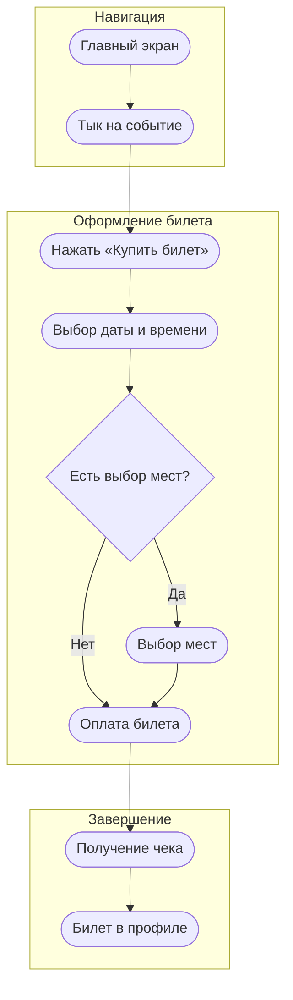
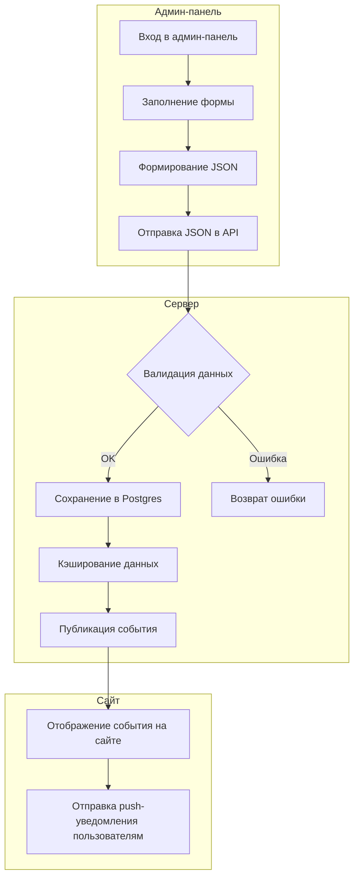
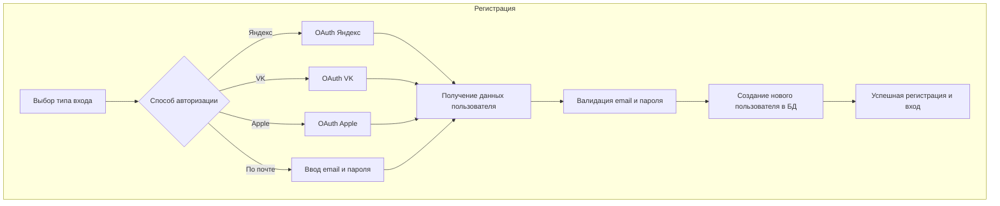
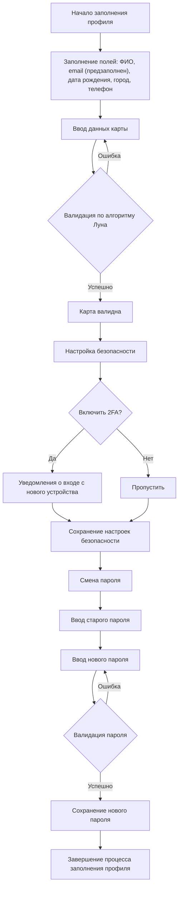

# FrontEnd KulturaGO


> [!IMPORTANT]
>## Установка
>
> ```bash
> git clone https://github.com/samogonshiki/KulturaGO_FrontEnd.git
> ```
> 
> ```bash
> cd KulturaGO_FrontEnd
> npm install
> ```

## Users Flow:

1) **флоу покупки билетов пользователя**



2) **флоу создания мероприятия**


3) **флоу регистрации**



4) **флоу заполнения профиля**




**by Finnik**
